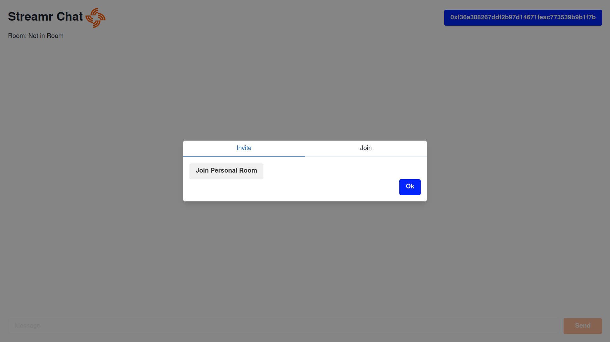

# streamr-chat

## Setup 
After you clone this repository you will need to run the following commands to install the dependencies and start the local web server:
```
$ npm install 
$ npm start
```

## Using the Streamr Chat
You will need to install the [Metamask browser extension](https://metamask.io/) to be able to authenticate on the Streamr Chat. 

After running `npm start` your default browser will navigate to the url [localhost:4000](http://localhost:4000):


You can link your Metamask account by clicking on the top-right corner "Connect" button. After you authorize the chat to use your address you will see the Rooms menu:


You can create your own chat room by clicking on the "Join Personal Room" button, which will prompt you to sign a challenge using Metamask:


Congratulations! Your chat room is now created. 

You will need to paste your peer's ethereum address on the "Invite" form:


On their end, they must paste your invite link and click on "Join":


Once the connection is established you can talk with all the peers in your personal room!


[](https://discord.gg/FVtAph9cvz)

## Other Resources
:globe_with_meridians: Website https://streamr.network/ <br/>
🗺️ Roadmap https://streamr.network/roadmap <br/>
:page_facing_up: Whitepaper https://streamr.network/whitepaper <br/>
:page_facing_up: Network whitepaper https://streamr.network/network-whitepaper <br/>
:books: Dev docs https://streamr.network/docs/introduction <br/>
:pencil: Blog https://blog.streamr.network/ <br/>
:bird: Twitter https://twitter.com/streamr <br/>
:computer: Github https://github.com/streamr-dev <br/>
🪙 Data Fund https://streamr.network/fund <br/>
